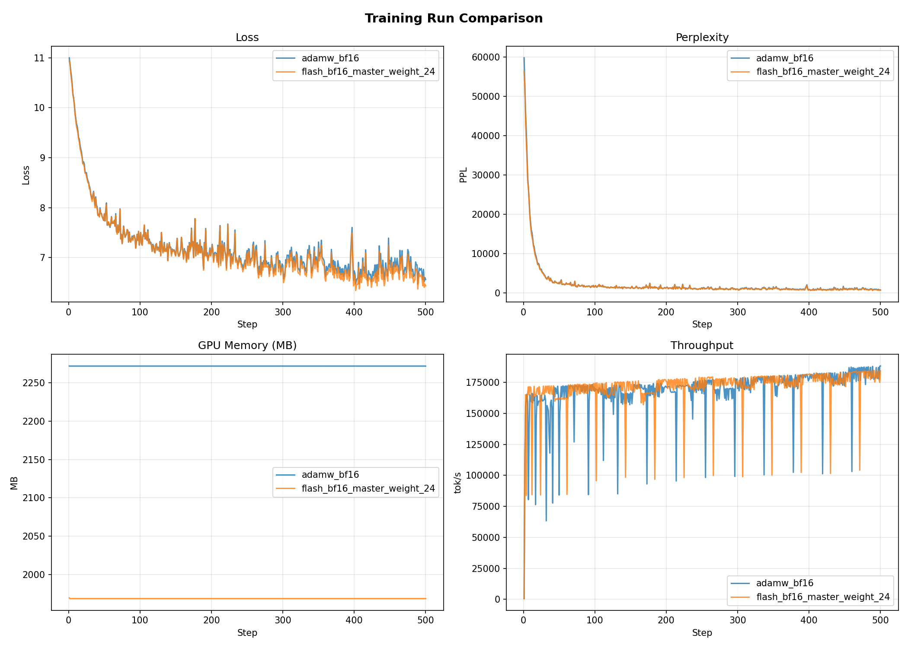
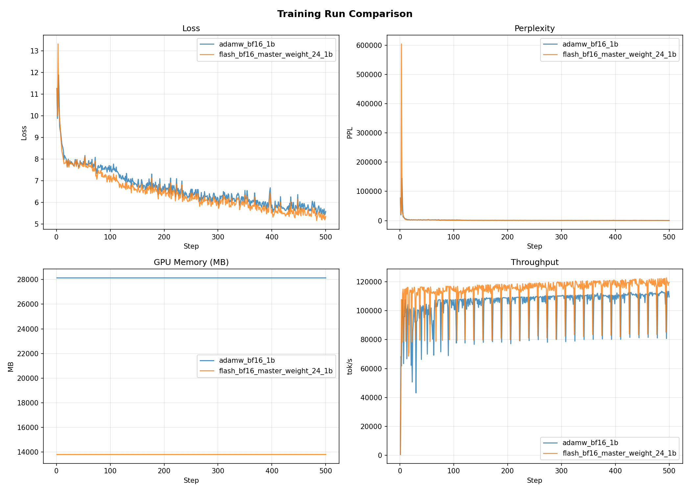

# FlashOptim Experiments

This repo contains experiments testing [FlashOptim](https://github.com/databricks/flashoptim) — a memory-efficient optimizer library — against standard AdamW on transformer language models at two scales: a 27M toy model and a ~1B LLaMA-style decoder.

---

## What is FlashOptim?

FlashOptim is a library by Databricks that re-thinks how optimizer state is stored during training. Standard mixed-precision training (e.g., AdamW + BF16) keeps a full FP32 copy of every parameter as "master weights" for the optimizer update step — this roughly doubles the memory cost of the model. FlashOptim eliminates this overhead by storing master weights in a compressed format (e.g., 24-bit) and shrinking the footprint of optimizer states and gradients, with minimal impact on convergence.

**Key ideas from the paper:**

- **Compressed master weights**: Instead of an FP32 copy of every parameter, FlashOptim stores master weights in a quantized format (configurable: 16 or 24 bits, default 24). It also shrinks the footprint of optimizer states (momentum, variance) and gradients.
- **No autocast needed**: The model lives natively in BF16. FlashOptim's optimizers handle the weight update in quantized precision internally — no `torch.amp.autocast` wrapper is needed.
- **Drop-in replacement**: `FlashAdamW`, `FlashAdam`, `FlashLion`, `FlashSGD`, and `FlashSGDW` share the same API as their PyTorch counterparts. A `cast_model` utility casts the model to BF16 before training begins.
- **Scales with model size**: The larger the model, the more dramatic the memory savings — because a larger fraction of total memory is optimizer state.

---

## Project Structure

```
flashoptim/
├── models/
│   ├── toy_model_1.py       # 27M toy transformer (encoder-style, 256-dim, 2 layers)
│   └── toy_model_2.py       # ~1B LLaMA-style decoder (RoPE, SwiGLU, RMSNorm)
├── configs/
│   ├── local.yaml           # Dataloader config for local parquet files
│   └── blob.yaml            # Dataloader config for Azure Blob Storage
├── experiments/
│   ├── experiment_1.txt     # Raw logs: 27M model run
│   ├── experiment_1.png     # Training curves: 27M model
│   ├── experiment_2.txt     # Raw logs: 1B model run
│   └── experiment_2.png     # Training curves: 1B model
├── train.py                 # Main training script (DDP, FlashOptim / AdamW paths)
├── distributed_dataloader.py
├── compare_runs.py          # Side-by-side metrics comparison
├── requirements.txt
└── notes/notes.txt
```

---

## Models

### Toy Transformer (27M)
`models/toy_model_1.py` — A small encoder-style transformer used as a sanity-check baseline.

- **Architecture**: `nn.TransformerEncoderLayer` with causal mask
- **Hidden size**: 256, **Heads**: 4, **Layers**: 2
- **Vocab**: GPT-2 (50,257), **Max seq len**: 2,048
- **Parameters**: ~27M

### LLaMA-style Decoder (~1B)
`models/toy_model_2.py` — A proper decoder-only transformer trained for the main experiment.

- **Architecture**: Pre-norm decoder with RoPE, SwiGLU FFN, RMSNorm
- **Hidden size**: 2,048, **Heads**: 16, **Layers**: 24, **FFN**: 5,504
- **Attention**: `F.scaled_dot_product_attention` (uses FlashAttention backend)
- **Vocab**: GPT-2 (50,257), **Max seq len**: 2,048
- **Parameters**: ~1B (with weight tying between `tok_emb` and `lm_head`)

---

## Training Setup

- **Dataset**: [FineWeb-Edu 10BT](https://huggingface.co/datasets/HuggingFaceFW/fineweb-edu) — 10B tokens of high-quality educational web text
- **Tokenizer**: GPT-2 BPE
- **Sequence length**: 2,048 tokens
- **Batch size**: 8 per GPU
- **Steps**: 500
- **Hardware**: 8× GPUs (DDP via `torchrun`)
- **LR**: 3e-4

**Run commands:**

```bash
# Standard AdamW (BF16 via autocast)
torchrun --nproc_per_node=8 train.py --config configs/local.yaml \
    --steps 500 --optimizer adamw --dtype bf16 --run-name adamw_bf16

# FlashAdamW (native BF16, 24-bit master weights)
torchrun --nproc_per_node=8 train.py --config configs/local.yaml \
    --steps 500 --optimizer flash_adamw --master-weight-bits 24 \
    --dtype bf16 --run-name flash_bf16_master_weight_24

# Compare
python compare_runs.py --runs adamw_bf16 flash_bf16_master_weight_24
```

---

## Experiments

### Experiment 1 — 27M Toy Transformer

Both runs trained the small toy model for 500 steps on FineWeb-Edu 10BT using 8 GPUs.



**Summary:**

| Metric | AdamW (BF16) | FlashAdamW (BF16, 24-bit) | Delta |
|---|---|---|---|
| Final loss | 6.5639 | 6.4375 | **-0.1264** |
| Final perplexity | 709.05 | 624.84 | **-84.21** |
| Avg step time | 1.247s | 1.250s | +0.2% |
| Avg throughput | 169,166 tok/s | 171,120 tok/s | +1.2% |
| Peak GPU memory | 2,272 MB | 1,969 MB | **-13.3%** |

**Observations:**
- FlashAdamW achieves **lower final loss and perplexity** than AdamW at the same step count.
- Memory is reduced by 13.3% — modest at this scale since model weights dominate over optimizer state for small models.
- Step time and throughput are essentially identical, showing no runtime cost to compression.

---

### Experiment 2 — ~1B LLaMA-style Decoder

The real test. At 1B parameters, optimizer state becomes a dominant fraction of total GPU memory. The same 500-step setup was repeated with the larger model.



**Summary:**

| Metric | AdamW (BF16) | FlashAdamW (BF16, 24-bit) | Delta |
|---|---|---|---|
| Final loss | 5.5773 | 5.3438 | **-0.2335** |
| Final perplexity | 264.36 | 209.30 | **-55.06** |
| Avg step time | 1.700s | 1.622s | **-4.6%** |
| Avg throughput | 104,890 tok/s | 113,721 tok/s | **+8.4%** |
| Peak GPU memory | 28,137 MB | 13,801 MB | **-51.0%** |

**Observations:**
- **51% memory reduction** — GPU memory dropped from ~28 GB to ~13.8 GB per device. In the standard path, the model stays in FP32 (~4GB for 1B params) and AdamW maintains FP32 momentum + variance (~4GB each), totaling ~12GB for model + optimizer state alone. FlashAdamW casts the model to native BF16 (~2GB) and compresses master weights, momentum, variance, and gradients — dramatically reducing this footprint.
- **Faster training**: ~4.6% reduction in step time and 8.4% higher token throughput, likely because smaller optimizer tensors improve cache efficiency and reduce memory bandwidth pressure.
- **Comparable or better convergence**: FlashAdamW achieves lower final loss (5.34 vs 5.58) and perplexity (209 vs 264), consistent with the 27M result and the paper's claim that FlashOptim does not degrade model convergence.
- The memory saving is large enough to **fit a larger model** on the same hardware, or to **increase batch size** — both of which would further improve training efficiency.

---

## Key Takeaways

1. **Memory savings scale with model size.** At 27M, FlashAdamW saves ~13% memory. At 1B, it saves ~51%. For multi-billion-parameter models, this could be the difference between fitting on 8 GPUs versus requiring many more.

2. **No convergence penalty — in fact, a small improvement.** Across both experiments FlashAdamW converges to a slightly lower loss than standard AdamW. The 24-bit master weight precision appears to be more than sufficient.

3. **No speed penalty.** Step times are within noise at 27M and measurably faster at 1B. There is no computational overhead from the compressed optimizer.

4. **Seamless integration.** Switching from AdamW to FlashAdamW requires changing two lines — the optimizer constructor and a `cast_model` call. No changes to the model, loss, or training loop logic.

---

## Installation

```bash
pip install -r requirements.txt
```

`requirements.txt`:
```
torch
pyarrow
pyyaml
transformers
pandas
flashoptim
```

---

## References

- [FlashOptim GitHub (Databricks)](https://github.com/databricks/flashoptim)
- Paper: *FlashOptim: Optimizers for Memory Efficient Training* — Jose Javier Gonzalez Ortiz, Abhay Gupta, Christopher Rinard, Davis Blalock (arXiv:2602.23349, 2026)
- [FineWeb-Edu dataset](https://huggingface.co/datasets/HuggingFaceFW/fineweb-edu)
